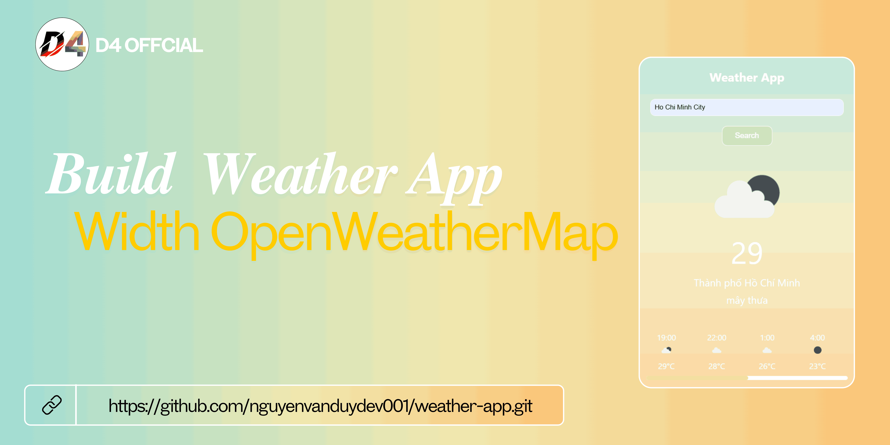

# Building a Weather App Project With OpenWeatherMap

## Demo


## Installation instructions

```
git clone https://github.com/nguyenvanduydev001/weather-app.git
```
----

## What the project helps to learn
> This project helps the learner better understand the use of the fetch() method in JavaScript, promises, and data in JSON format. Upon completing this project, software developers can enhance their abilities and develop something with practical, real-life usability.

[Live demo]()